.. _manual_asesor_comercial:

=========================================
MANUAL DE USUARIO: ASESOR COMERCIAL
=========================================

:Sistema: CRM SIATI Group · Odoo 19 Enterprise
:Rol: Asesores Comerciales (aplica también a Soportes Comerciales)
:Versión del documento: 1.0 · Julio 2026

.. contents:: Contenido
   :local:
   :depth: 2

1. Introducción
===============

Este manual explica el trabajo diario del asesor comercial en el CRM SIATI:
gestionar sus contactos, llevar sus oportunidades por el embudo comercial,
cotizar servicios de carga internacional y registrar sus gestiones.

**Qué puede hacer un asesor:**

* Crear y gestionar **sus propios** contactos, oportunidades, cotizaciones y
  actividades.
* Cotizar con el motor tarifario (aéreo, courier, LCL marítimo, LCL Global).
* Solicitar aprobaciones (descuentos, pérdida de oportunidad, pricing, crédito).
* Ver sus metas comerciales y dashboards operativos.

**Qué NO puede hacer un asesor:**

* Ver contactos u oportunidades de otros asesores.
* Aprobar descuentos, pérdidas ni cruces de sucursal (eso lo hace Supervisión).
* Cambiar el asesor asignado a un contacto.
* Editar tarifas, catálogos o metas.

2. Ingreso al sistema
=====================

#. Abra el navegador y entre a la URL del CRM.
#. Ingrese su correo corporativo y contraseña.
#. Al entrar verá el menú principal con las aplicaciones a las que tiene
   acceso: **CRM**, **Contactos**, **Ventas** y **Dashboards**.

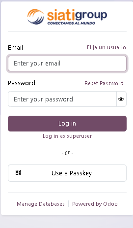

   Figura 1. Pantalla de inicio de sesión.

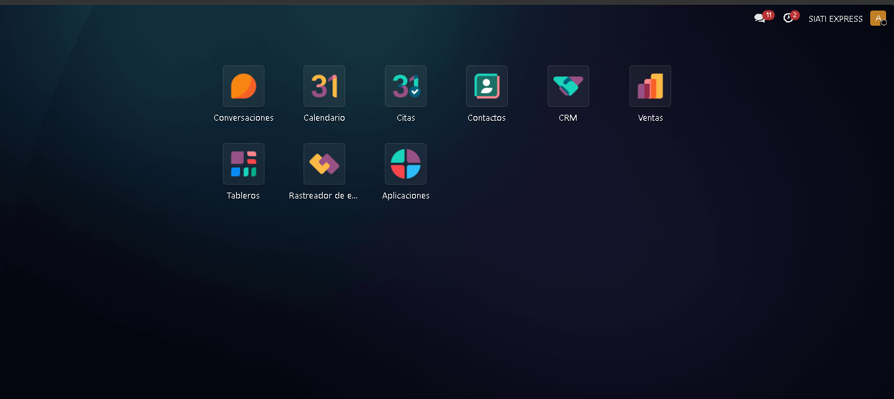

   Figura 2. Menú principal con las aplicaciones disponibles para el rol.

3. Gestión de contactos
=======================

3.1 Ver sus contactos
---------------------

Menú **Contactos**. La vista muestra únicamente los **contactos principales**
(empresas o personas, no los subcontactos) que tienen a usted como asesor
comercial.

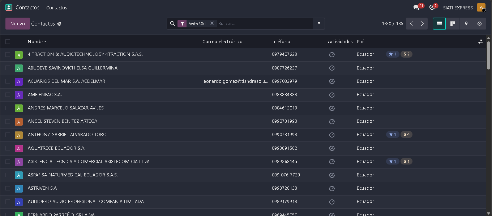

   Figura 3. Vista de contactos asignados al asesor.

3.2 Crear un contacto
---------------------

#. En **Contactos**, pulse **Nuevo**.
#. Elija el tipo: **Empresa** o **Persona**.
#. Complete la **identificación**: seleccione el tipo (RUC / Cédula /
   Pasaporte) y digite el número.

   * Cédula: 10 dígitos. RUC: 13 dígitos. El sistema valida el formato y que no
     exista otro contacto con el mismo documento.

#. **Autollenado desde el SRI:** al digitar 7 o más dígitos del RUC, el sistema
   consulta el SRI y rellena automáticamente razón social, nombre comercial,
   código CIIU, provincia/cantón/parroquia, representante legal, teléfono y
   dirección. Revise y confirme los datos.
#. El campo **Asesor comercial** se asigna automáticamente con su usuario. No
   lo puede cambiar (solo Supervisión o Gerencia).
#. Complete la **provincia**: al fijarla, el sistema asigna automáticamente la
   **sucursal** que cubre esa provincia.
#. Guarde.

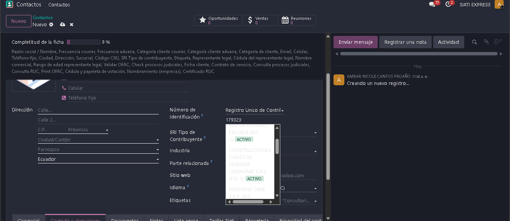

   Figura 4. Formulario de creación de un contacto.

.. important::

   **Contacto de otra provincia (cruce de sucursal):** si la provincia del
   contacto pertenece a una sucursal distinta a la suya, el sistema genera
   automáticamente una **solicitud de cruce de sucursal** que debe aprobar su
   supervisor. Mientras esté pendiente o rechazada, **no podrá crear
   oportunidades** para ese contacto. El formulario muestra una alerta con el
   estado del cruce.

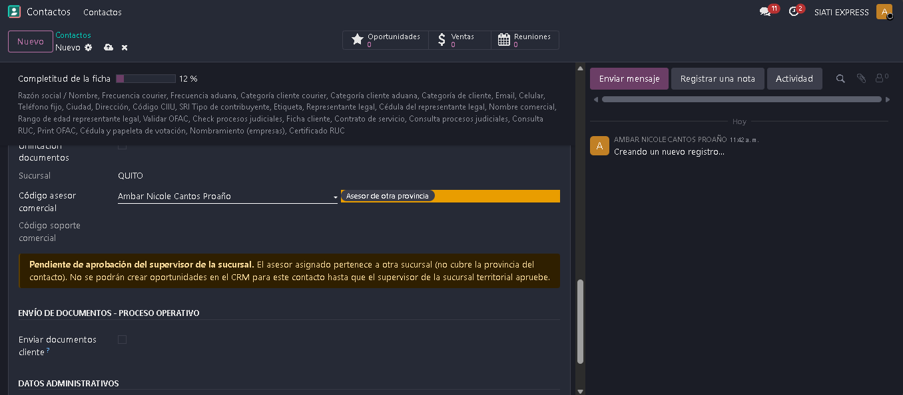

   Figura 5. Alerta de cruce de sucursal pendiente de aprobación.

3.3 La barra de completitud de la ficha
---------------------------------------

En la parte superior del formulario verá el **porcentaje de completitud** y la
lista de **campos por completar**. La ficha se considera completa cuando están
llenos los datos esenciales (identificación, razón social, categorías, email,
teléfonos, ciudad, dirección, sucursal, asesor, CIIU, tipo de contribuyente,
etiqueta), los datos del representante legal (empresas), las validaciones
(OFAC y procesos judiciales) y los documentos del cliente cargados.

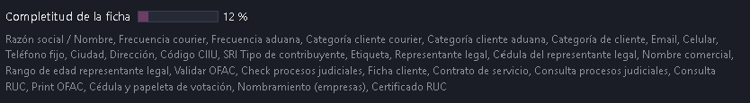

   Figura 6. Barra de completitud y campos pendientes.

3.4 Categoría de cliente
------------------------

La categoría se calcula **automáticamente** según la frecuencia de importación:

.. list-table::
   :header-rows: 1
   :widths: 30 35 35

   * - Categoría
     - Categoría Aduana
     - Categoría Courier
   * - Bronce
     - 0 – 06
     - 0 – 11
   * - Plata
     - 07 – 12
     - 12 – 24
   * - Oro
     - 13 – 23
     - 25 – 36
   * - Black
     - 24 o más
     - 37 o más

* **Frecuencia aduana** → Categoría cliente aduana.
* **Frecuencia courier** → Categoría cliente courier.
* **Categoría de cliente (global)** = la mayor de las dos.

Usted solo digita las frecuencias; las categorías no son editables.

3.5 Validaciones de cumplimiento
--------------------------------

Estas validaciones son obligatorias para avanzar la oportunidad a
**Precalificación** y cuentan para la completitud de la ficha.

a) Validar OFAC (lista CSL de trade.gov)
~~~~~~~~~~~~~~~~~~~~~~~~~~~~~~~~~~~~~~~~

#. Verifique que el contacto tenga **razón social (o nombre)** y **país**.
#. Pulse el botón **Validar OFAC** en la ficha del contacto.
#. El sistema consulta la lista consolidada de sanciones (CSL) de EE. UU. por
   el nombre de la empresa y, si es empresa, también por el **representante
   legal**.
#. El resultado queda registrado en la ficha: respuesta, evidencia de la
   consulta y el check **Validar OFAC**.

   * Si hay coincidencias, la ficha marca **"En lista OFAC"**: informe a su
     supervisor antes de continuar.
   * Si modifica el nombre, razón social, país o representante legal, el check
     se **resetea** y debe validar de nuevo.

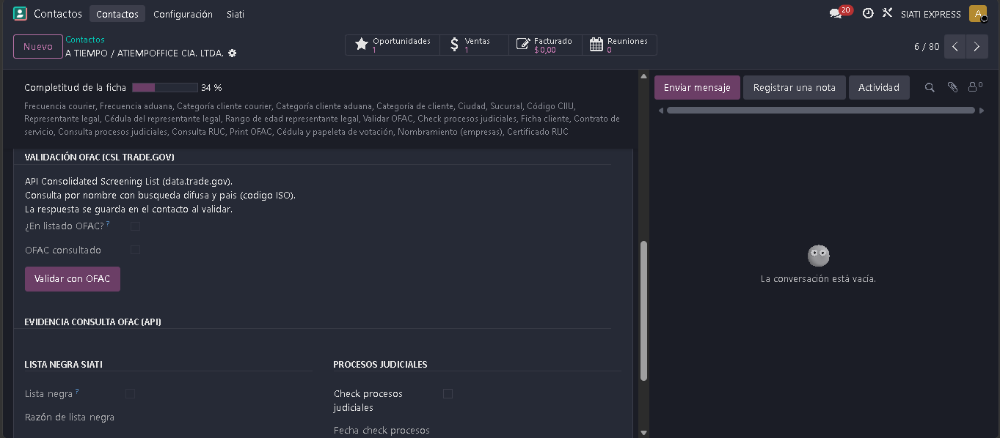

   Figura 7. Validación OFAC y evidencia de la consulta.

b) Check de procesos judiciales
~~~~~~~~~~~~~~~~~~~~~~~~~~~~~~~

#. Realice la consulta en la web de la Función Judicial.
#. Marque el check **procesos judiciales** en la ficha e indique si tiene
   procesos y la observación.
#. Suba el respaldo (captura) en el documento **Consulta Procesos Judiciales**
   de la pestaña Documentos.

c) Lista negra
~~~~~~~~~~~~~~

La lista negra se carga automáticamente desde un archivo oficial. Si el
contacto aparece marcado como **Lista negra**, el sistema **bloquea** crearle
oportunidades y cotizaciones. Usted no puede editar esta marca.

3.6 Documentos del cliente
--------------------------

En la pestaña **Documentos** de la ficha se gestiona el checklist documental.
Cada documento tiene un tipo y un estado.

.. list-table::
   :header-rows: 1
   :widths: 40 60

   * - Documento
     - Cuándo se exige
   * - Consulta Procesos Judiciales
     - Para avanzar a Precalificación (interno)
   * - Consulta RUC
     - Para avanzar a Precalificación (interno, solo contactos con RUC)
   * - Print OFAC (Clinton)
     - Para avanzar a Precalificación (interno)
   * - Cédula y papeleta de votación
     - Para avanzar a Ganado
   * - Nombramiento
     - Para avanzar a Ganado (solo empresas)
   * - Certificado RUC
     - Para avanzar a Ganado (solo contactos con RUC)
   * - Contrato de servicio
     - Para entrar a Solicitud IE (excepto clientes Atlas)
   * - Ficha Cliente (FCO-02)
     - Onboarding documental

**Subir un documento:** pulse el clip / campo de archivo en la línea del
documento, seleccione el archivo (respete el tamaño máximo) y guarde.

**Generar el Contrato de servicio:**

#. Verifique que el contacto tenga actividad económica y representante legal.
#. Pulse **Generar contrato**: el sistema produce el PDF.
#. Envíelo al cliente para firma: puede firmarlo **en el portal** o usted puede
   subir el contrato firmado escaneado.
#. El documento pasa por revisión (**Aprobar** / **Rechazar**).

**Ficha de Cliente (FCO-02):** pulse **Generar ficha** o solicite al cliente
completarla en el portal (formulario KYC). Al completarse genera el PDF.

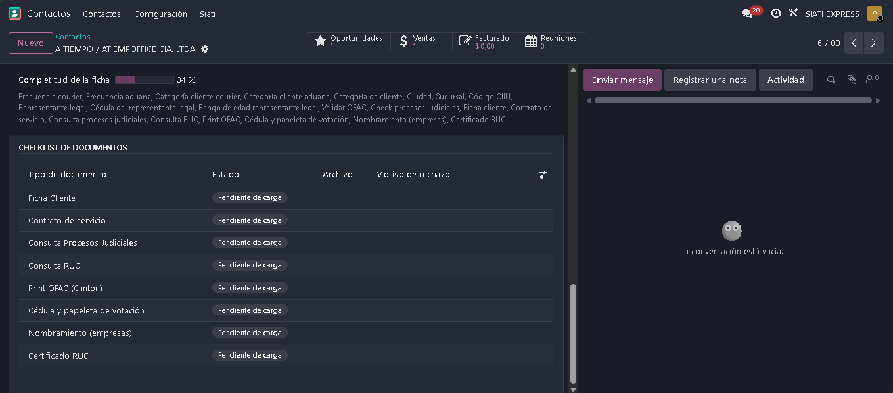

   Figura 8. Checklist documental del cliente.

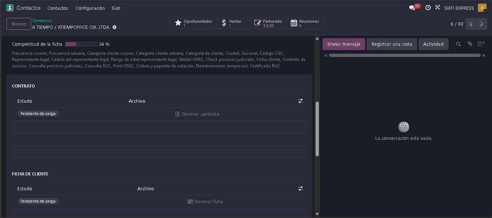

   Figura 9. Generación y revisión del contrato de servicio.

3.7 Paquetería del cliente (Atlas)
----------------------------------

Si el cliente tiene paquetería en Atlas, la ficha muestra sus **paquetes**
sincronizados (se actualizan cada 10 minutos). El cliente también los ve en
vivo en su portal (``/my/packages``).

4. Oportunidades (CRM)
======================

4.1 El embudo comercial
-----------------------

Menú **CRM → Mi flujo de trabajo**. Las etapas son:

**Nuevo → Precalificación → Calificación → Gestión → Propuesta → Ganado →
Solicitud IE**

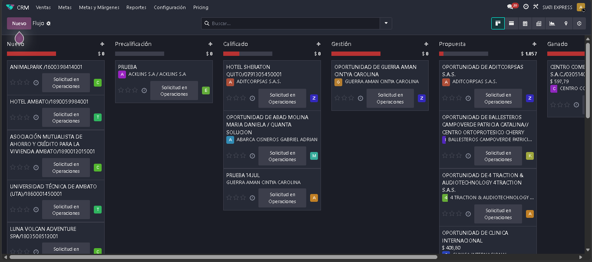

   Figura 10. Embudo comercial en vista kanban.

4.2 Crear una oportunidad
-------------------------

#. En CRM, pulse **Nuevo** en la columna correspondiente.
#. Asigne el **contacto** (obligatorio desde Precalificación). Recuerde:
   clientes en lista negra o con cruce de sucursal pendiente están bloqueados.
#. Registre las **líneas de servicio** a prospectar.
#. Guarde. El nombre se guarda en mayúsculas automáticamente.

**Código de seguimiento:** al llegar a Precalificación, el sistema asigna un
código automático con el formato ``ASESOR-AAAAMMDD-NNNN``.

**Salto automático:** si el cliente ya tiene historial de oportunidades
ganadas, la oportunidad nueva salta directamente a **Propuesta**.

4.3 Requisitos para avanzar de etapa
------------------------------------

El sistema valida (y bloquea) el paso de etapa si falta algo:

.. list-table::
   :header-rows: 1
   :widths: 30 70

   * - Para avanzar a...
     - Se exige
   * - Precalificación
     - Contacto asignado, asesor, categoría de cliente (salvo Atlas),
       documentos de precalificación (judicial, RUC, OFAC)
   * - Ganado
     - Documentos de gestión (cédula y papeleta, nombramiento si es empresa,
       certificado RUC)
   * - Ganado
     - **Cotización creada** + confirmación del **monto real** (wizard)
   * - Solicitud IE
     - **Contrato de servicio cargado** (salvo Atlas). Al entrar se crea
       automáticamente la **instrucción de embarque**

Si el sistema le muestra un error al mover la tarjeta, lea el mensaje: siempre
indica qué falta.

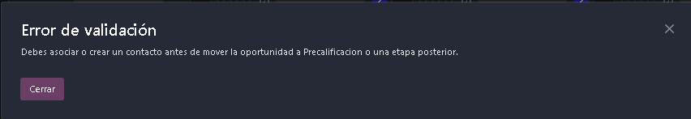

   Figura 11. Mensaje de validación al cambiar de etapa.

4.4 Registrar gestiones (actividades)
-------------------------------------

Toda gestión con el cliente se registra como **actividad** (llamada, visita,
correo, etc.):

#. En la oportunidad, pulse **Actividades** y programe la siguiente gestión
   (tipo, fecha, resumen).
#. Al completarla, márquela como hecha y programe la siguiente. Las gestiones
   se pueden **encadenar** (una depende de la anterior).
#. La pestaña de gestiones de la oportunidad muestra el historial completo, la
   **última gestión realizada** y la **siguiente planificada**.

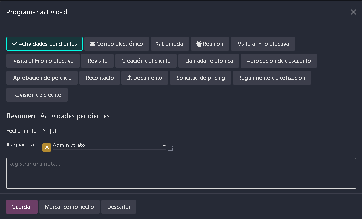

   Figura 12. Programación y seguimiento de gestiones.

4.5 Ganar una oportunidad
-------------------------

#. Verifique que exista al menos una cotización.
#. Pulse **Ganado**.
#. El sistema abre el wizard de **monto real**: confirme el valor real de
   cierre.
#. Se notifica automáticamente al equipo de su sucursal.

4.6 Perder una oportunidad (requiere aprobación)
------------------------------------------------

#. Pulse **Perdido** e indique el **motivo de pérdida**.
#. Se genera una **solicitud de aprobación de pérdida** hacia la Supervisión de
   su sucursal: la oportunidad queda en estado "pérdida pendiente de
   aprobación".
#. Si el supervisor aprueba, la oportunidad se marca perdida y el sistema
   programa un **recontacto automático a los 90 días**.
#. Si la rechaza, la oportunidad sigue activa.

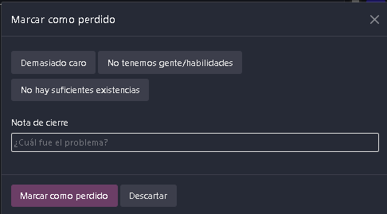

   Figura 13. Registro del motivo de pérdida.

5. Cotizaciones
===============

5.1 Crear una cotización de envío
---------------------------------

#. Desde la oportunidad, cree la cotización (toda cotización **debe** tener
   oportunidad).
#. Marque **Cotización de envío** y elija el **tipo de servicio** (aéreo,
   courier, LCL marítimo, LCL Global).
#. El sistema carga automáticamente las líneas con los productos del servicio y
   las valoriza con el **motor tarifario** (rangos por peso/volumen, mínimos,
   seguro).
#. Complete los **datos del embarque** (origen/destino, peso, volumen según el
   formato).
#. **Servicios adicionales:** use el asistente para añadir productos opcionales
   del servicio.
#. El código de seguimiento de la cotización se genera como
   ``{código de la oportunidad}-COT``.

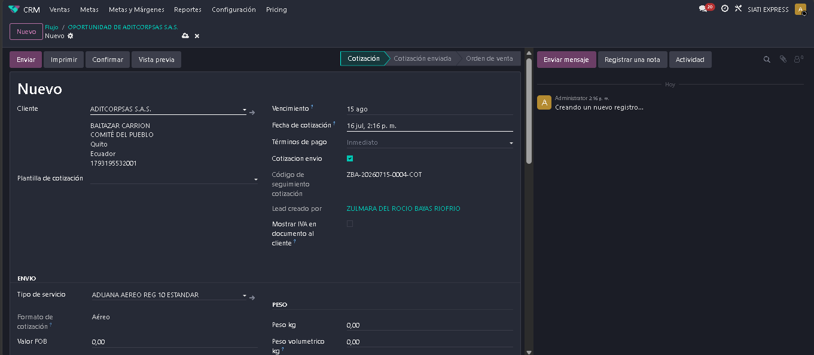

   Figura 14. Cotización de envío con las líneas valorizadas.

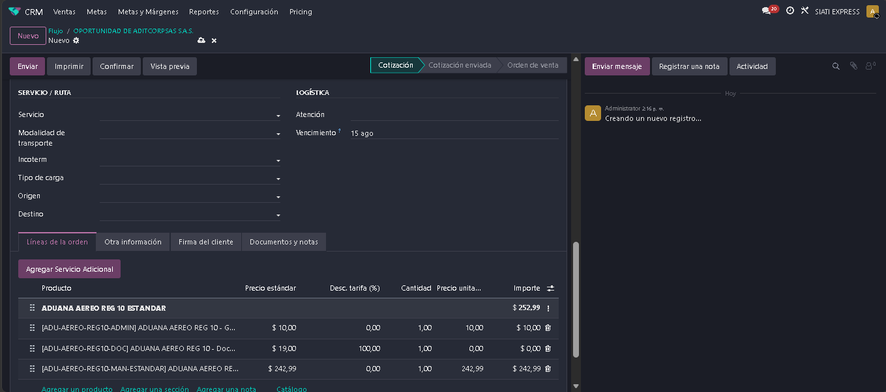

   Figura 15. Datos del embarque y servicios adicionales.

5.2 Descuentos (requieren aprobación)
-------------------------------------

Hay dos tipos de descuento y ambos están **topados** según su nivel:

* **Descuento de tarifa por línea:** si supera su tope permitido, el sistema
  envía una **solicitud de aprobación** al supervisor/administrativo de su
  sucursal. La cotización queda bloqueada para envío hasta que se resuelva.
* **Descuento volumétrico:** toma el valor negociado del cliente; si lo
  modifica y su sucursal tiene activada la aprobación volumétrica, también
  requiere aprobación.

Usted verá en la cotización el estado del descuento (pendiente / aprobado /
rechazado). Si el aprobador **rechaza**, los descuentos se resetean y debe
cotizar sin ellos o solicitar un nuevo nivel.

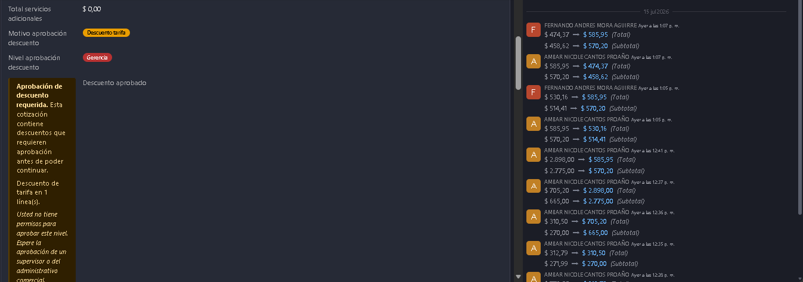

   Figura 16. Estado de la solicitud de descuento.

5.3 Pricing manual
------------------

Si un producto de la cotización **requiere cotización manual** (no tiene
tarifa), el sistema genera una **solicitud de pricing** al equipo PRICING. No
podrá enviar ni confirmar la cotización mientras falten precios. Cuando pricing
asigna el precio, la línea se actualiza y usted recibe una actividad de
**seguimiento de cotización**.

5.4 Enviar el PDF al cliente
----------------------------

El botón de envío genera el **PDF de cotización** con las secciones logísticas
(Flete, Exterior, Nacionalización, Transporte Interno, Costos Locales, Extras),
el manejo de IVA y su bloque de asesor comercial. Los textos
REMARKS/DECLARACIÓN se congelan al enviar.

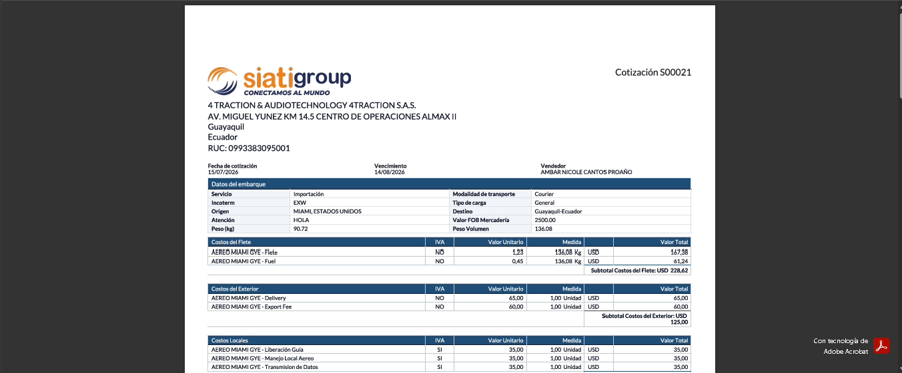

   Figura 17. PDF de cotización generado para el cliente.

5.5 Solicitar revisión de crédito
---------------------------------

Si el cliente requiere crédito, desde la ficha del contacto pulse **Solicitar
revisión de crédito**. La solicitud llega **solo a Tesorería** (único rol que
gestiona la matriz de crédito).

6. Mis metas y dashboards
=========================

* **CRM → Metas:** consulte sus metas mensuales (venta y margen) por sucursal y
  empresa, su ejecución real (facturas) y % de cumplimiento. Las metas las
  define Gerencia; usted solo las visualiza.
* **Dashboards** disponibles para su rol: *Cumplimiento de Metas Individuales*,
  *Leads*, *Cotizaciones*, *Clientes Potenciales*, *Clientes*, *Actividades
  Comerciales por Asesor*, *Visualizador Visitas*, *Oportunidades — Última y
  Siguiente Gestión*.

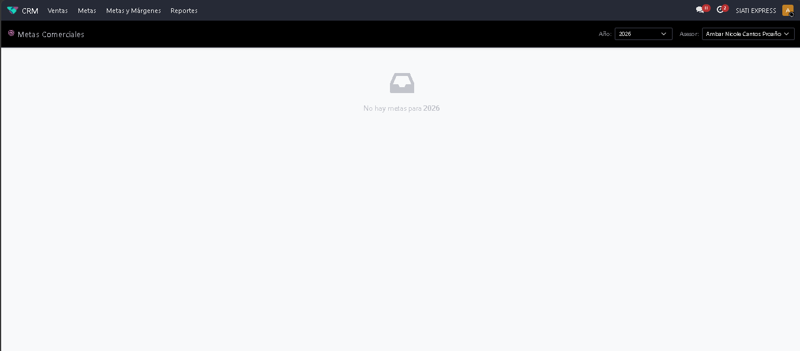

   Figura 18. Dashboard de metas y cumplimiento del asesor.

7. Preguntas frecuentes
=======================

**No puedo crear una oportunidad para un contacto.**
   Revise: (1) ¿el contacto está en lista negra?, (2) ¿tiene un cruce de
   sucursal pendiente o rechazado?, (3) ¿es usted el asesor asignado?

**El sistema no me deja avanzar la oportunidad de etapa.**
   Lea el mensaje de error: indica el documento o dato faltante (ver la tabla
   de la sección 4.3).

**No encuentro un contacto que sé que existe.**
   Solo ve los contactos donde usted es el asesor. Si el contacto es de otro
   asesor, pida a su supervisor la reasignación.

**Hice la validación OFAC pero el check se desmarcó.**
   Cambió algún dato clave del contacto (nombre, razón social, país o
   representante legal). Vuelva a pulsar **Validar OFAC**.

**Necesito un descuento mayor a mi tope.**
   Aplíquelo: el sistema pedirá aprobación automáticamente a su supervisor. No
   podrá enviar la cotización hasta que se apruebe.
