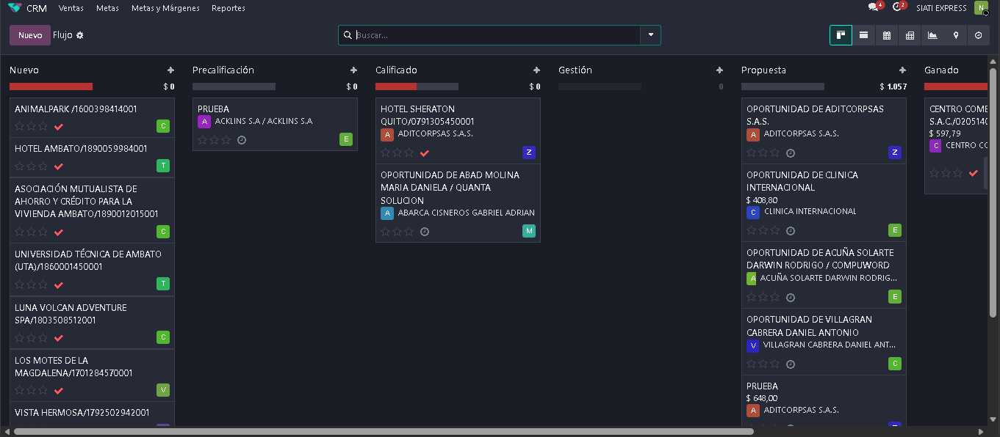
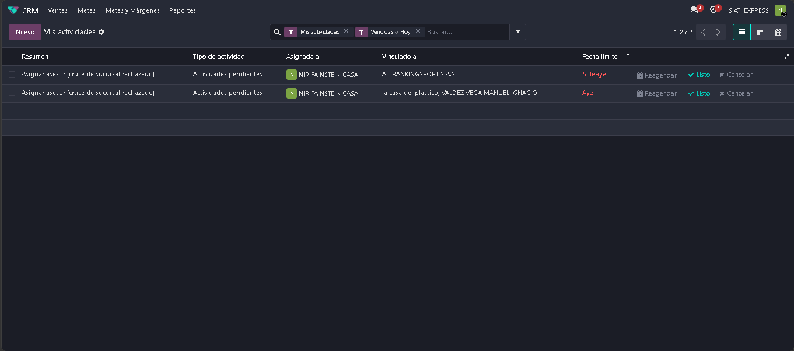
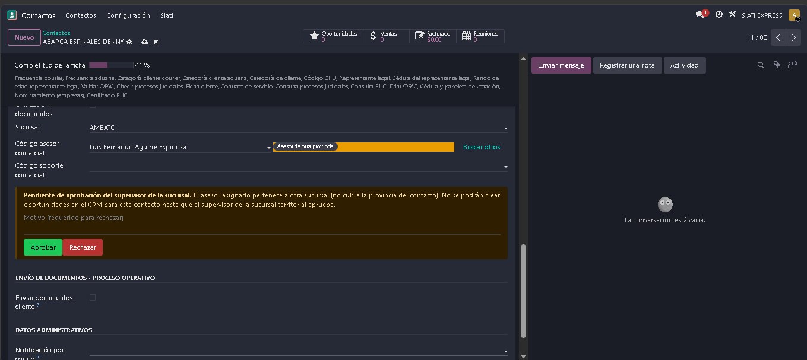
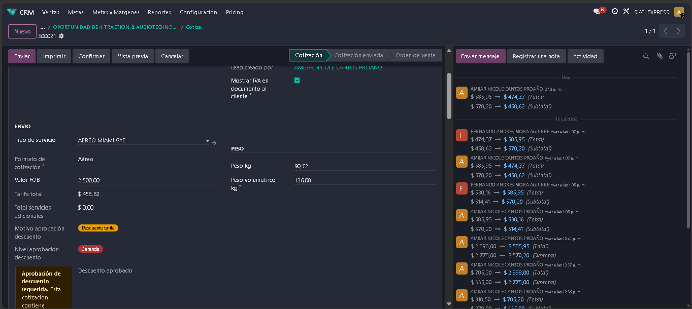
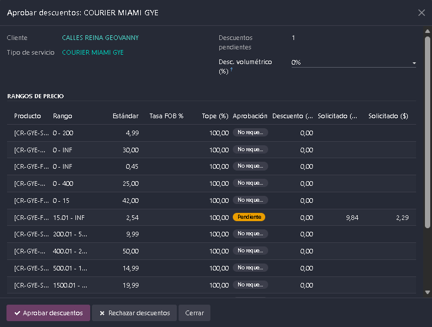
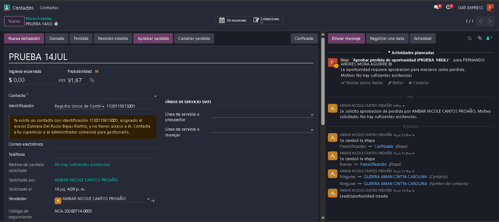
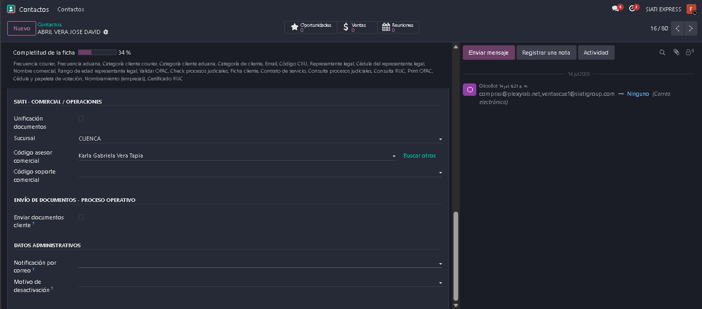

.. _manual_supervisor:

=========================================
MANUAL DE USUARIO: SUPERVISOR
=========================================

:Sistema: CRM SIATI Group · Odoo 19 Enterprise
:Rol: Supervisores (Administrativo Comercial)
:Versión del documento: 1.0 · Julio 2026

.. contents:: Contenido
   :local:
   :depth: 2

1. Introducción
===============

El supervisor gobierna la operación comercial de **su sucursal**: ve los
contactos, oportunidades y cotizaciones de todos los asesores de la sucursal, y
es el **decisor** de las aprobaciones del día a día (cruces de sucursal,
descuentos, pérdidas y asignación de asesores).

**Qué puede hacer un supervisor (además de todo lo del asesor):**

* Ver todos los contactos, oportunidades, cotizaciones y actividades **de su
  sucursal**.
* **Aprobar o rechazar**: cruces de sucursal, descuentos en cotización,
  descuentos tarifarios negociados y pérdidas de oportunidad.
* Cambiar el **asesor comercial** y el soporte de un contacto; **reasignar
  asesor** masivamente.
* Editar catálogos y tarifas.

**Qué NO puede hacer:**

* Ver otras sucursales (solo Gerencia/Administrador).
* Editar metas ni márgenes de rentabilidad (solo Gerencia).
* Editar la matriz de crédito (solo Tesorería).

.. note::

   Su visibilidad depende de que su usuario esté registrado como **supervisor
   de la sucursal** (en la configuración de la sucursal) y como miembro del
   **equipo comercial** correspondiente. Si no ve registros que debería ver,
   pida al administrador revisar ambas listas.

2. Visibilidad por sucursal
===========================

* **Contactos, actividades y reuniones:** filtrados por su **rol de sucursal**
  (usted aparece en la lista de supervisores de la sucursal).
* **Oportunidades y cotizaciones:** filtradas por el **equipo comercial** de la
  sucursal.

   Figura 1. Visibilidad de los registros de la sucursal.

3. Sus aprobaciones
===================

Las solicitudes llegan como **actividades** en su bandeja (icono de reloj) y
algunas también por correo. Revise a diario **Actividades** desde el menú
superior.

   Figura 2. Bandeja de actividades pendientes.

3.1 Cruce de sucursal
---------------------

**Cuándo se dispara:** un asesor de su sucursal registra un contacto cuya
provincia pertenece a **otra** sucursal.

**Quién decide:** usted, como supervisor de la sucursal **del asesor**. (La
gerencia territorial y la gerencia de la sucursal del asesor reciben solo una
alerta informativa.)

**Cómo resolver:**

#. Abra la actividad de **cruce de sucursal** (desde la bandeja o la ficha del
   contacto).
#. Para **aprobar**: marque la actividad como hecha **sin escribir comentario**.
#. Para **rechazar**: marque la actividad como hecha **escribiendo el motivo**
   en el comentario.

**Efecto:** mientras el cruce esté pendiente o rechazado, el CRM bloquea la
creación de oportunidades para ese contacto. Al aprobar, el asesor puede
trabajar el cliente con normalidad.

   Figura 3. Resolución de una solicitud de cruce de sucursal.

3.2 Descuento en cotización
---------------------------

**Cuándo se dispara:** un asesor aplica un descuento por encima de su tope
(descuento de tarifa por línea) o modifica el descuento volumétrico en una
sucursal con aprobación volumétrica activa.

**Cómo resolver:**

#. Reciba la actividad / correo de aprobación y abra la cotización.
#. Revise las líneas con descuento y el nivel solicitado.
#. Pulse **Aprobar descuento** o **Rechazar descuento**.

   * Al rechazar, los descuentos de la cotización se **resetean** y el asesor es
     notificado con el motivo.

   Figura 4. Aprobación o rechazo del descuento solicitado.

3.3 Descuentos tarifarios negociados (tarifas por cliente)
----------------------------------------------------------

Las **tarifas negociadas** por cliente/tipo de servicio y los **precios
negociados por rango** también pasan por aprobación cuando el descuento supera
el tope del solicitante:

#. Abra el registro de tarifa negociada (Ventas → Productos SIATI / tarifas del
   cliente).
#. Use **Aprobar descuentos** o **Rechazar descuentos**.
#. Cada cambio queda en el **historial versionado** de la tarifa; el PDF de la
   tarifa puede enviarse al cliente por correo.

   Figura 5. Registro de tarifa negociada y su historial.

3.4 Pérdida de oportunidad
--------------------------

**Cuándo se dispara:** un asesor intenta marcar como perdida una oportunidad.

**Cómo resolver:**

#. Reciba la actividad de aprobación de pérdida (Supervisión de la sucursal del
   lead).
#. Abra la oportunidad y revise el motivo indicado.
#. Pulse **Aprobar pérdida** (la oportunidad se marca perdida y se programa el
   recontacto a 90 días) o **Cancelar** la solicitud (la oportunidad sigue
   activa).

   Figura 6. Aprobación de la pérdida de una oportunidad.

4. Gestión del equipo
=====================

4.1 Cambiar el asesor de un contacto
------------------------------------

En la ficha del contacto, edite el campo **Asesor comercial** (los asesores
disponibles se filtran por sucursal). El vendedor del contacto se sincroniza
automáticamente. Solo Supervisión/Gerencia puede hacerlo.

4.2 Reasignar asesor (masivo)
-----------------------------

Para transferir la cartera de un asesor (salida, vacaciones, redistribución):

#. Abra el asistente **Reasignar asesor**.
#. Seleccione el asesor origen y el asesor destino.
#. Pulse **Reasignar**: se transfieren los contactos y oportunidades **que
   usted puede ver** (su sucursal) y se actualiza el asesor en cada contacto.

   Figura 7. Asistente de reasignación masiva de cartera.

4.3 Supervisar la gestión diaria
--------------------------------

* **Dashboard "Actividades Comerciales por Asesor":** carga de trabajo y estado
  de las actividades de cada asesor.
* **Dashboard "Oportunidades — Última y Siguiente Gestión":** detecta
  oportunidades sin gestión reciente o sin siguiente gestión planificada.
* **Dashboard "Gestión por Asesor"** y **"Rendimiento Comercial":** comparativa
  de clientes, leads, montos y cumplimiento por asesor.

5. Catálogos y configuración comercial
======================================

El supervisor puede mantener los catálogos comerciales (menú **Contactos →
Siati → Configuración campos**, según permisos):

* Categorías de cliente (aduana / courier), tipos de empleado, ejecutivos de
  cobranzas.
* **Documentos de cliente:** definir qué documentos se exigen y desde qué etapa
  (Precalificación / Gestión / Ganado), si aplican solo a empresas o solo a
  contactos con RUC, y si son de uso interno (no visibles en portal).
* Tipos de servicio, rangos de tarifas y jerarquía de descuentos (menú
  **Ventas**).

.. warning::

   Los cambios en catálogos afectan las validaciones de etapa de **todos** los
   asesores. Coordine con Gerencia antes de modificar documentos obligatorios o
   topes de descuento.

6. Preguntas frecuentes
=======================

**Me llegó una alerta de cruce pero no tengo botón para decidir.**
   Si usted es **gerencia** notificada, su actividad es solo informativa: al
   marcarla como hecha solo cierra el aviso. Decide el **supervisor de la
   sucursal del asesor**.

**Un asesor no ve un contacto que le reasigné.**
   Verifique que el campo Asesor comercial del contacto quedó actualizado y que
   el contacto no sea un subcontacto (la vista muestra solo contactos
   principales).

**Rechacé un descuento por error.**
   El asesor debe volver a aplicar el descuento para generar una nueva
   solicitud de aprobación.

**No veo oportunidades de mi sucursal.**
   Su usuario debe estar en el **equipo comercial** de la sucursal (para
   leads/cotizaciones) y en la lista de **supervisores de la sucursal** (para
   contactos/actividades). Pida al administrador validar ambas configuraciones.
