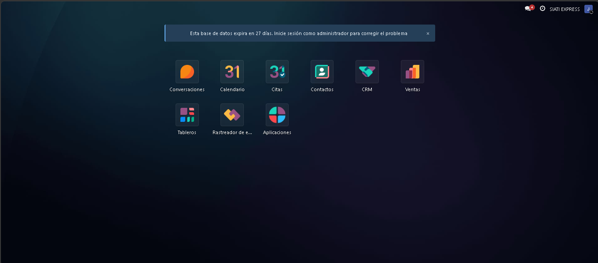
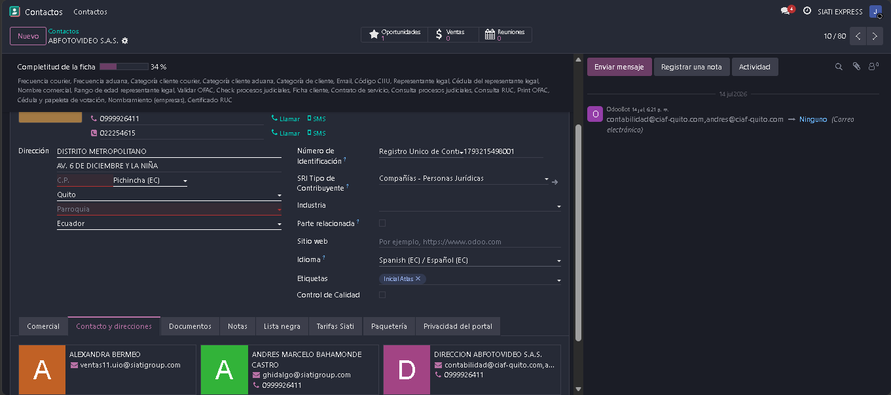
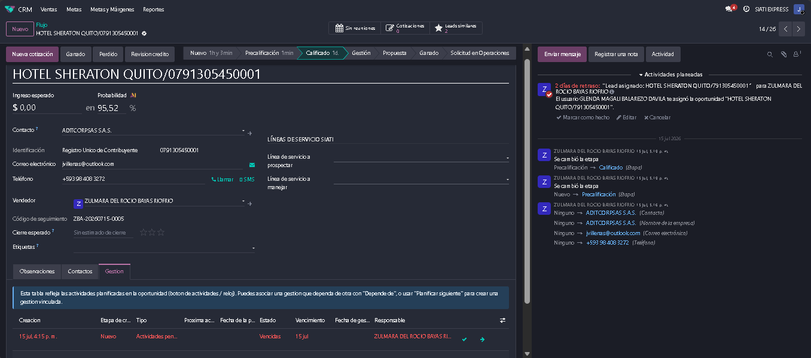
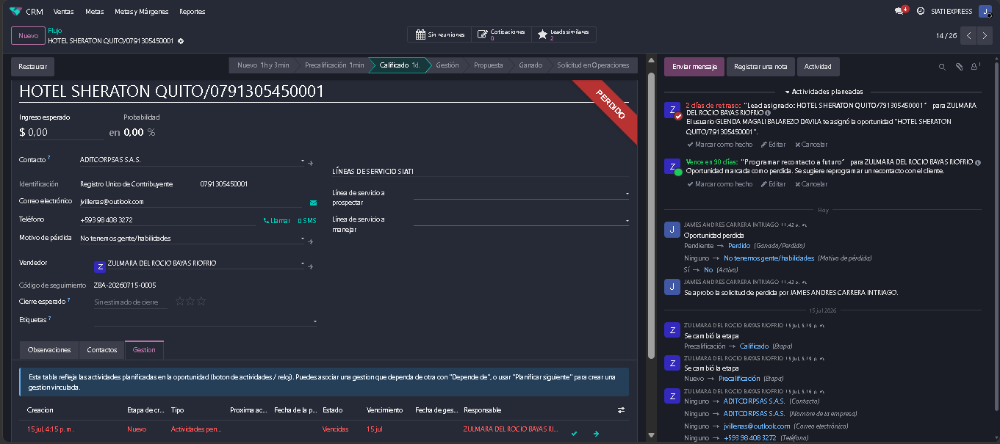
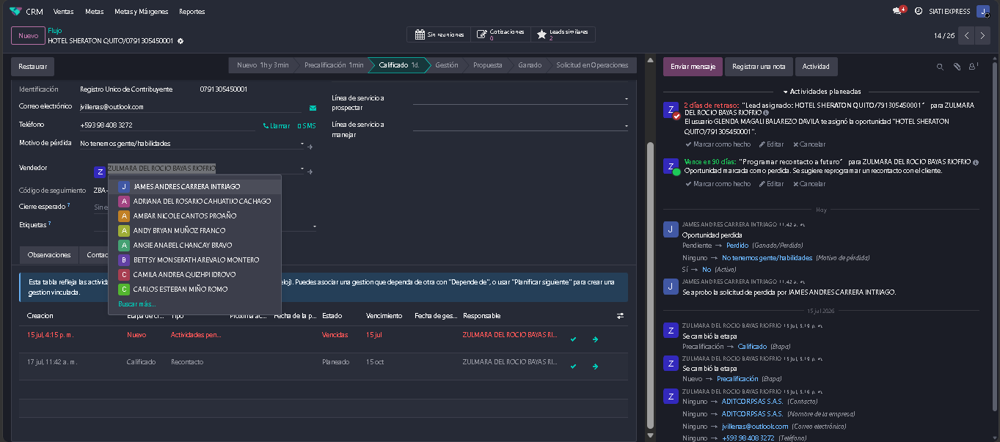
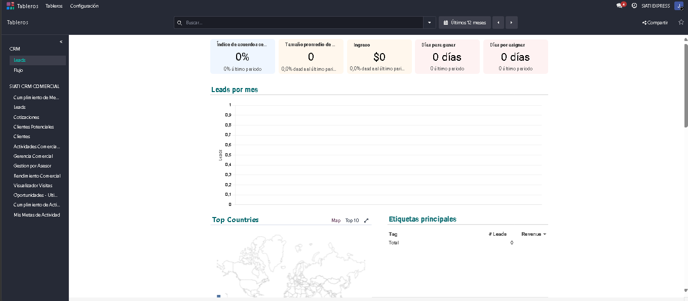

.. _manual_analista:

=========================================
MANUAL DE USUARIO: ANALISTA
=========================================

:Sistema: CRM SIATI Group · Odoo 19 Enterprise
:Rol: Analistas
:Versión del documento: 1.0 · Julio 2026

.. contents:: Contenido
   :local:
   :depth: 2

1. Introducción
===============

El analista tiene un rol de **visualización y control** sobre la operación
comercial de su sucursal. Puede consultar toda la información (contactos,
oportunidades, cotizaciones, actividades) sin ser el propietario, y cuenta con
dos facultades operativas puntuales: **restaurar oportunidades perdidas** y
**reasignar asesores**.

**Qué puede hacer un analista:**

* Ver todos los contactos, oportunidades, cotizaciones y actividades **de su
  sucursal** (solo lectura).
* **Restaurar** una oportunidad perdida (facultad exclusiva de
  Analista/Administrador).
* **Reasignar asesor** (transferir cartera entre asesores).
* Consultar los dashboards comerciales para análisis y seguimiento.

**Qué NO puede hacer:**

* Aprobar descuentos, pérdidas ni cruces de sucursal (no participa en ningún
  flujo de aprobación).
* Crear o editar contactos, oportunidades o cotizaciones de los asesores.
* Editar catálogos, tarifas, metas o márgenes.

.. note::

   Su visibilidad depende de que su usuario esté registrado como **analista de
   la sucursal** (en la configuración de la sucursal). Si no ve la información
   de su sucursal, pida al administrador revisar esa lista.

2. Ingreso y navegación
=======================

#. Ingrese con su correo corporativo y contraseña.
#. Aplicaciones disponibles: **CRM**, **Contactos**, **Ventas** (consulta) y
   **Dashboards**.

   Figura 1. Aplicaciones disponibles para el rol Analista.

3. Consulta de información
==========================

3.1 Contactos
-------------

Menú **Contactos**: verá los contactos principales de su sucursal, con la ficha
comercial completa: identificación, categoría de cliente, completitud,
cumplimiento (OFAC, judicial, lista negra), documentos y paquetería Atlas.

Puntos útiles para revisión:

* **Barra de completitud** y campos faltantes de cada ficha.
* **Pestaña Documentos:** estado del checklist documental por etapa.
* **Marcas de cumplimiento:** check OFAC (y si está "En lista OFAC"), check
  judicial, lista negra.

   Figura 2. Ficha comercial del contacto.

3.2 Oportunidades
-----------------

Menú **CRM**: embudo completo de la sucursal (Nuevo → Precalificación →
Calificación → Gestión → Propuesta → Ganado → Solicitud IE). Puede revisar por
oportunidad:

* El **código de seguimiento** (``ASESOR-AAAAMMDD-NNNN``).
* El historial de **gestiones** (actividades), la última gestión hecha y la
  siguiente planificada.
* El estado de las **aprobaciones** (pérdida, descuentos, cruce de sucursal).
* Las **cotizaciones** vinculadas y su estado de pricing/descuento.

   Figura 3. Embudo de oportunidades de la sucursal.

3.3 Cotizaciones
----------------

Menú **Ventas**: cotizaciones de la sucursal con sus líneas valorizadas,
descuentos aplicados y estado (borrador, enviada, confirmada).

4. Facultades operativas
========================

4.1 Restaurar una oportunidad perdida
-------------------------------------

Cuando una oportunidad se perdió por error o el cliente retomó la negociación:

#. En CRM, filtre por **Perdidas**.
#. Abra la oportunidad y pulse **Restaurar**.
#. La oportunidad vuelve al embudo activo. Notifique al asesor para que retome
   la gestión.

Esta acción es exclusiva del rol Analista (y Administrador): ni el asesor ni el
supervisor pueden restaurar.

   Figura 4. Restauración de una oportunidad perdida.

4.2 Reasignar asesor
--------------------

Para transferir la cartera de un asesor a otro:

#. Abra el asistente **Reasignar asesor**.
#. Seleccione asesor origen y destino.
#. Pulse **Reasignar**: se transfieren los contactos y oportunidades visibles
   para usted (su sucursal) y se actualiza el asesor de cada contacto.

   Figura 5. Asistente de reasignación de cartera.

5. Dashboards para análisis
===========================

Dashboards operativos disponibles para su consulta:

.. list-table::
   :header-rows: 1
   :widths: 40 60

   * - Dashboard
     - Úselo para
   * - Leads
     - Embudo por etapa, ganadas/perdidas, revenue esperado por asesor
   * - Cotizaciones
     - Cotizaciones abiertas, montos, estado de pricing, descuentos por aprobar
   * - Clientes Potenciales
     - Prospectos activos, alta probabilidad, **sin actividad**, alertas de
       lista negra
   * - Clientes
     - Cartera por asesor/categoría, clientes con crédito, por recuperar
   * - Actividades Comerciales por Asesor
     - Carga y estado de la gestión de cada asesor
   * - Oportunidades — Última y Siguiente Gestión
     - Oportunidades sin seguimiento o sin próxima gestión planificada
   * - Visualizador Visitas
     - Ejecución de gestiones de campo y conversión

   Figura 6. Dashboard comercial de seguimiento.

**Sugerencia de rutina de control:**

#. Revise **Oportunidades — Última y Siguiente Gestión** para detectar
   oportunidades abandonadas.
#. Cruce con **Clientes Potenciales sin actividad**.
#. Informe a Supervisión los casos que requieran acción (usted no aprueba ni
   reasigna oportunidades individuales).

6. Preguntas frecuentes
=======================

**¿Puedo aprobar un descuento si el supervisor no está?**
   No. El rol Analista no participa en aprobaciones. La solicitud debe
   resolverla un Supervisor o Gerencia.

**Restauré una oportunidad pero el asesor no la ve trabajable.**
   Verifique que el contacto no tenga bloqueos (lista negra, cruce de sucursal
   pendiente).

**No veo una sucursal que necesito analizar.**
   Su rol ve una sola sucursal. Si necesita otra, el administrador debe
   agregarlo como analista en esa sucursal.

**¿Puedo editar un dato mal digitado en una ficha?**
   No directamente: reporte al asesor propietario o al supervisor de la
   sucursal.
