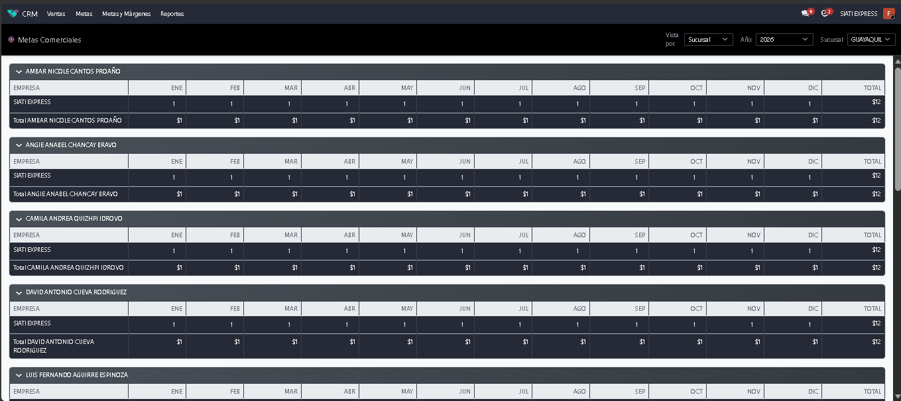
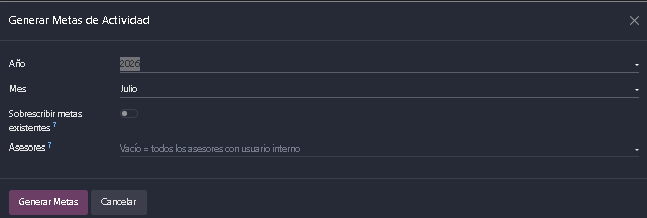
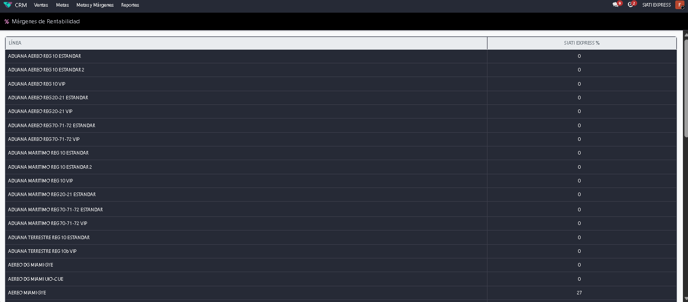
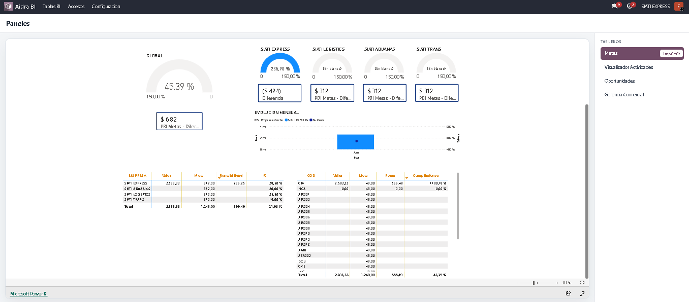
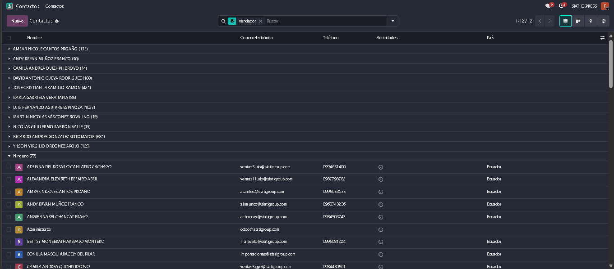
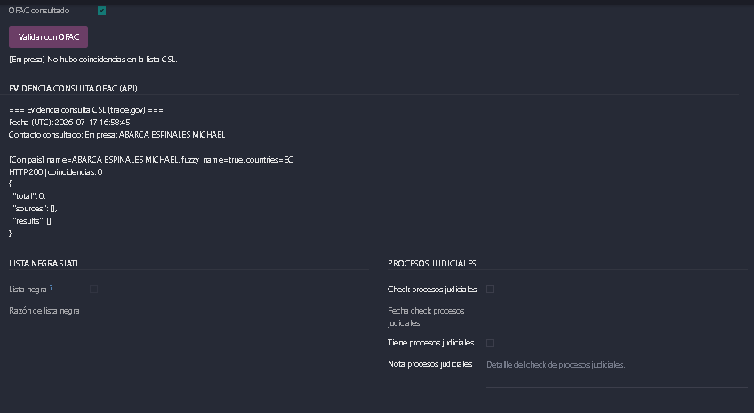

.. _manual_gerencia:

=========================================
MANUAL DE USUARIO: GERENCIA
=========================================

:Sistema: CRM SIATI Group · Odoo 19 Enterprise
:Rol: Gerencia
:Versión del documento: 1.0 · Julio 2026

.. contents:: Contenido
   :local:
   :depth: 2

1. Introducción
===============

Gerencia tiene la visión y el control **transversal** del negocio comercial:
además de todas las facultades del Supervisor, administra la **planeación**
(metas comerciales y márgenes de rentabilidad), los datos maestros sensibles y
los tableros ejecutivos.

**Qué puede hacer Gerencia (además de todo lo del supervisor):**

* Ver y editar **todas las metas comerciales** (los demás solo ven las propias).
* Editar los **márgenes de rentabilidad** por empresa/sucursal/tipo de servicio.
* Ver los contactos **sin asesor asignado** (invisibles para el resto).
* Editar el **código de asesor** y la categoría de clientes Atlas.
* Recibir alertas informativas de **cruces de sucursal** de su territorio.
* Acceder al tablero ejecutivo **Gerencia Comercial**.

2. Planeación comercial
=======================

2.1 Metas comerciales
---------------------

Menú **CRM → Metas**. Cada meta define, por **asesor × sucursal × empresa ×
mes**: monto de venta objetivo y margen objetivo. El sistema calcula
automáticamente los acumulados trimestrales y anuales, y la **ejecución real** a
partir de las facturas contabilizadas.

**Crear metas masivamente:**

#. Abra el **generador de metas** (wizard de generación masiva).
#. Seleccione el año, las sucursales/asesores y los montos base.
#. Genere: se crean las metas mensuales del período. (Existe también un proceso
   automático anual.)

**Editar una meta:** solo Gerencia puede modificar metas. Los asesores ven su
avance en el dashboard de metas.

   Figura 1. Metas comerciales por asesor, sucursal y período.

   Figura 2. Generador masivo de metas.

2.2 Márgenes de rentabilidad
----------------------------

Menú de **Márgenes de Rentabilidad** (rejilla editable, exclusiva de Gerencia):
define el margen esperado por **empresa / sucursal / tipo de servicio**. Estos
márgenes alimentan los dashboards de cumplimiento (margen objetivo vs. real).

   Figura 3. Rejilla editable de márgenes de rentabilidad.

3. Tableros ejecutivos
======================

.. list-table::
   :header-rows: 1
   :widths: 40 60

   * - Dashboard
     - Contenido
   * - **Gerencia Comercial** (exclusivo)
     - KPIs con comparativo vs. período anterior: pipeline, cotizaciones,
       actividades
   * - Cumplimiento de Metas Individuales
     - Meta anual/trimestral por asesor, % cumplimiento, venta real/cobrada,
       margen
   * - Rendimiento Comercial
     - Meta vs. realidad a nivel de equipo/sucursal
   * - Gestión por Asesor
     - Comparativa cruzada por asesor (clientes, leads, oportunidades, montos)
   * - Clientes / Clientes Potenciales / Leads / Cotizaciones
     - Cartera, prospectos, embudo y cotizaciones por sucursal

   Figura 4. Tablero ejecutivo Gerencia Comercial.

Adicionalmente, **Aidra BI** ofrece dashboards externos embebidos (según los
accesos configurados).

4. Aprobaciones y alertas
=========================

4.1 Todas las aprobaciones del supervisor
-----------------------------------------

Gerencia puede resolver los mismos flujos que Supervisión cuando corresponde:
descuentos en cotización (**Aprobar/Rechazar descuento**), descuentos tarifarios
negociados (**Aprobar/Rechazar descuentos**), pérdidas (**Aprobar pérdida**) y
asignación de asesores. Consulte el detalle paso a paso en el
:ref:`manual_supervisor`, sección 3.

4.2 Alertas de cruce de sucursal (informativas)
-----------------------------------------------

Cuando un asesor registra un contacto de una provincia fuera de su sucursal:

* **Decide el supervisor de la sucursal del asesor.**
* La **gerencia territorial** y la gerencia de la sucursal del asesor reciben
  **una alerta informativa** (una sola vez).
* Si usted marca esa actividad como hecha, solo cierra su aviso: **no aprueba ni
  rechaza** el cruce.

Use estas alertas para monitorear cuántos clientes se están captando fuera del
territorio de cada sucursal.

5. Datos maestros sensibles
===========================

5.1 Contactos sin asesor
------------------------

La regla de visibilidad muestra a Gerencia los contactos **sin asesor comercial
asignado** (nadie más los ve). Revíselos periódicamente y asigne asesor para que
entren a la operación.

   Figura 5. Contactos sin asesor comercial asignado.

5.2 Asesores comerciales
------------------------

Menú **Contactos → Siati → Configuración campos → Asesores comerciales**: cada
asesor tiene código (el **código** queda bloqueado tras la creación y solo
Gerencia puede editarlo), categoría (Senior/Junior/Soporte), sucursal
(exactamente una) y usuario vinculado.

5.3 Sucursales y roles de sucursal
----------------------------------

Menú **Sucursales Siati**: cada sucursal define sus **provincias** (una
provincia pertenece a una única sucursal, y esto gobierna la asignación
automática y los cruces) y sus tres listas de roles:

* **Supervisores** (deciden cruces y aprueban descuentos/pérdidas de la
  sucursal).
* **Analistas** (visualización).
* **Gerencia** (alertas territoriales).

.. note::

   Estas listas, junto con los **equipos comerciales** (miembros y lista de
   acceso comercial), determinan quién ve qué. Si un supervisor o analista
   reporta que no ve información de su sucursal, revise aquí primero.

5.4 Categoría de clientes Atlas
-------------------------------

Los clientes migrados de Atlas conservan su categoría histórica; solo Gerencia
puede ajustarla.

6. Control de cumplimiento
==========================

Gerencia supervisa la debida diligencia de la cartera:

* **Lista negra:** se actualiza automáticamente desde el archivo oficial
  (import Excel configurado). Los marcados quedan bloqueados para oportunidades
  y cotizaciones.
* **OFAC/CSL:** cada ficha registra el resultado y la **evidencia** de la
  consulta a trade.gov (empresa y representante legal). El indicador "En lista
  OFAC" resalta coincidencias.
* **Procesos judiciales:** check con fecha, observación y respaldo documental.
* El dashboard **Clientes** incluye la alerta de lista negra sobre la cartera.

   Figura 6. Control de cumplimiento sobre la cartera de clientes.

7. Preguntas frecuentes
=======================

**¿Por qué no puedo aprobar un cruce de sucursal si soy Gerencia?**
   Por diseño, el cruce lo decide el **supervisor de la sucursal del asesor**.
   Su actividad es solo un aviso territorial.

**Un supervisor no ve las oportunidades de su sucursal.**
   Verifique dos cosas: que esté en la lista de **supervisores** de la sucursal
   (Sucursales Siati) y que sea miembro del **equipo comercial** correspondiente.
   Contactos/actividades usan la primera; oportunidades/cotizaciones usan la
   segunda.

**¿Puedo delegar la edición de metas?**
   No con el rol estándar: metas y márgenes son exclusivos de Gerencia (y
   Administrador).

**¿Cómo doy de baja un asesor?**
   Use el asistente **Reasignar asesor** para transferir su cartera, luego
   archive el asesor y su usuario. Coordine con el administrador del sistema.
