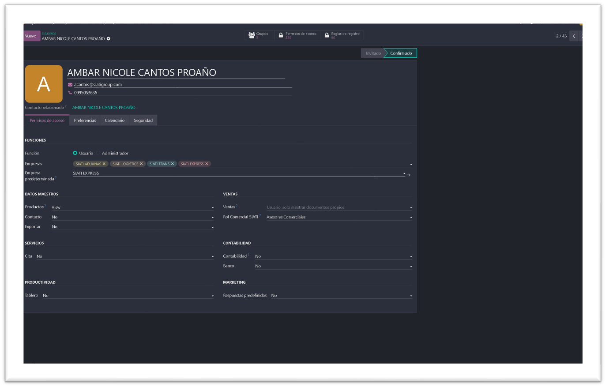
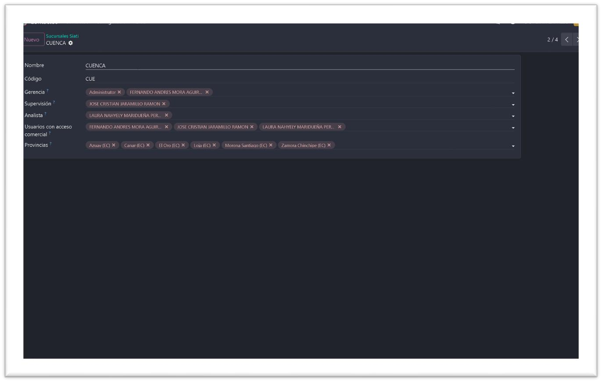
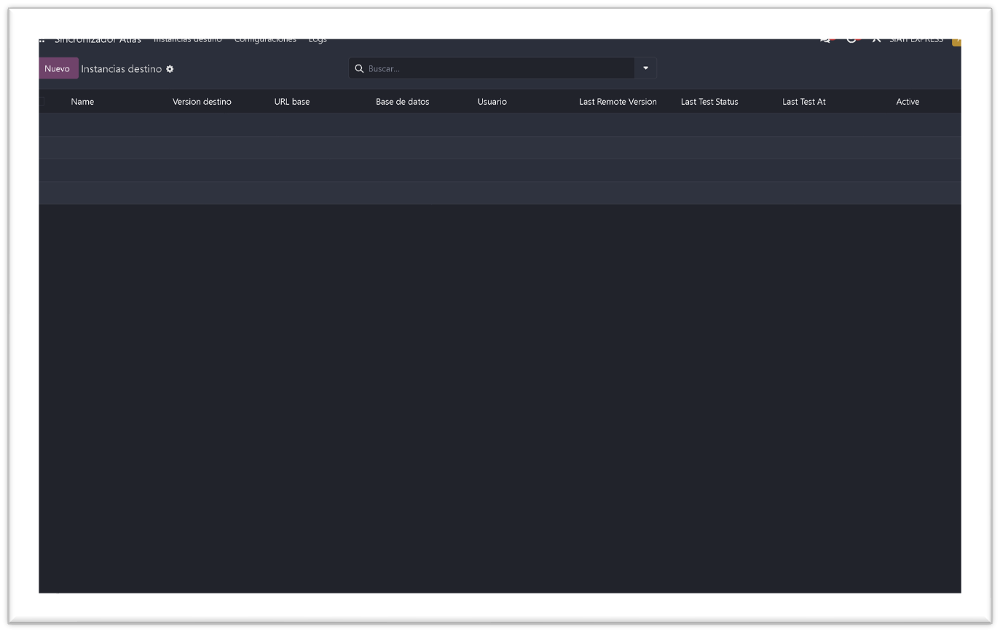

.. _manual_administrador_ti:

=========================================
MANUAL DE USUARIO: ADMINISTRADOR (TI)
=========================================

:Sistema: CRM SIATI Group · Odoo 19 Enterprise
:Rol: Administrador (TI)
:Versión del documento: 2.0 · Agosto 2026

*Incorpora las funciones de soporte técnico de primer nivel.*

.. contents:: Contenido
   :local:
   :depth: 2

1. Introducción
===============

El Administrador es el rol de TI de SIATI dentro del CRM. Tiene **acceso total**
al sistema: hereda todas las facultades de Gerencia (y por lo tanto de
Supervisores y Asesores) y suma la administración técnica de Odoo
(``base.group_system``) y el alcance global de Ventas. Es el único rol que puede
eliminar registros y administrar usuarios y permisos.

Además de administrar la plataforma, este rol atiende el soporte de primer nivel
a los usuarios del CRM: diagnostica problemas de visibilidad, resuelve errores
de importación, restablece accesos y decide qué se escala al equipo de
desarrollo (secciones 7 y 8).

**Qué puede hacer el Administrador (además de todo lo de Gerencia):**

* Ver y editar **todos** los contactos, oportunidades y cotizaciones de
  **todas** las sucursales.
* **Eliminar** contactos y oportunidades (ningún otro rol puede).
* Editar **cotizaciones de cualquier asesor** (los demás roles solo
  aprueban/rechazan descuentos por flujo).
* Gestionar **usuarios, roles y permisos**.
* Administrar el **Sincronizador Atlas**, paquetería del portal y remarks.
* Crear/eliminar registros de **todos los catálogos** (los roles gestores solo
  crean/editan).
* Gestionar las **Solicitudes de Pricing**.
* Ver y editar todas las metas y usar el generador masivo sin restricción de
  sucursal.
* Activar el **modo desarrollador** para depurar vistas, reglas de registro y
  campos técnicos.
* Atender el soporte de primer nivel de los usuarios del CRM.

2. Gestión de usuarios y roles
==============================

2.1 Asignar el rol SIATI
------------------------

Menú **Ajustes → Usuarios y compañías → Usuarios**. Cada usuario interno debe
tener exactamente **un rol** del privilegio "Rol Siati":

.. list-table::
   :header-rows: 1
   :widths: 40 60

   * - Rol
     - Alcance resumido
   * - Asesores Comerciales
     - Sus propios contactos y oportunidades
   * - Supervisores (Administrativo Comercial)
     - Su sucursal + aprobaciones
   * - Analistas
     - Consulta global de contactos; gestión en su sucursal
   * - Gerencia
     - Todo lo del supervisor + metas, márgenes, datos maestros
   * - Administrador (TI)
     - Acceso total, incluida la administración técnica

.. important::

   **No asigne grupos estándar de Odoo a los roles de sucursal.** En particular,
   **"Ventas: Administrador"** (Todos los documentos) hace que el usuario vea y
   gestione TODOS los leads y cotizaciones de todas las sucursales, anulando el
   aislamiento por sucursal. El alcance correcto se logra solo con el rol SIATI
   + las listas de la sucursal + el equipo comercial.

   Figura 1. Ficha de usuario: rol comercial SIATI y permisos de acceso.

2.2 Alta de un usuario nuevo (checklist)
----------------------------------------

#. Crear el usuario con su correo corporativo y asignar **un** rol SIATI.
#. Si es asesor: crear su ficha en **Asesores comerciales** (código, categoría,
   sucursal, usuario vinculado).
#. Si es supervisor/analista/gerencia: agregarlo a la **lista correspondiente de
   su sucursal** (menú Sucursales Siati) **y** al **equipo comercial** de la
   sucursal (miembros o lista de acceso). Contactos/actividades usan las listas
   de la sucursal; oportunidades/cotizaciones usan el equipo comercial.

   Figura 2. Configuración de una sucursal: listas de Gerencia, Supervisión,
   Analista y provincias.

3. Operaciones exclusivas del Administrador
===========================================

.. list-table::
   :header-rows: 1
   :widths: 28 24 48

   * - Operación
     - Dónde
     - Nota
   * - Eliminar contactos / oportunidades
     - Vista de lista o formulario
     - Prefiera archivar; elimine solo duplicados o errores de captura
   * - Editar cotizaciones de cualquier asesor
     - Ventas
     - Los descuentos de los demás roles siempre van por flujo de aprobación
   * - Solicitudes de Pricing
     - Menú de Pricing
     - Gestión exclusiva
   * - Metas de venta de todas las sucursales
     - CRM → Metas
     - Incluye el generador masivo sin restricción
   * - Reuniones y actividades de todos
     - Calendario
     - Los demás roles solo leen las de su sucursal
   * - Catálogos: crear y eliminar
     - Contactos → Siati → Configuración campos
     - Los roles gestores no eliminan

4. Sincronizador Atlas (exclusivo)
==================================

Menús, modelos y botón de sincronización visibles **solo** para el
Administrador. Desde aquí se configura la conexión al ERP Atlas (credenciales,
alcance del pull incremental) y se supervisan los vínculos de clientes migrados.

* El campo de **contraseña** de la conexión está restringido.
* La **categoría Atlas** de los clientes migrados solo la ajusta
  Gerencia/Administrador.
* La consulta de **paquetería** del portal de clientes (``/my/packages``)
  depende de esta conexión.
* Si el sincronizador falla y no se resuelve reintentando, puede requerir
  revisión del servidor: coordine con el equipo de desarrollo.

   Figura 3. Sincronizador Atlas: instancias destino y estado de la última
   conexión.

5. Cumplimiento y datos sensibles
=================================

* **Lista negra:** administra la importación del archivo oficial (import Excel
  configurado). Los marcados quedan bloqueados para oportunidades y
  cotizaciones; el bloqueo aplica a **todos** los roles, incluido el
  Administrador.
* **OFAC/CSL:** la clave del API de trade.gov se configura por parámetro del
  sistema; cada ficha guarda el resultado y la evidencia de la consulta.
* **Tipos de documento de contacto:** su configuración (obligatoriedad por
  etapa, requisitos por tipo de persona) es tarea del Administrador; los cambios
  se despliegan con el módulo.

6. Modo desarrollador y mantenimiento
=====================================

El Administrador puede activar **Herramientas de desarrollador** (Ajustes) para
depurar vistas, revisar reglas de registro o campos técnicos. Úselo para
diagnosticar, no para modificar la configuración de producción. Recuerde:

* Los cambios de permisos, vistas y datos maestros estructurales se hacen en los
  **módulos** (repositorio) y se despliegan a pruebas/producción, no
  directamente en la base de producción.
* Antes de eliminar cualquier registro, verifique que no sea preferible
  archivar: el historial se pierde al eliminar y la acción no es reversible.
* Documente en el ticket correspondiente todo cambio de permisos o de
  configuración que realice.

7. Soporte a usuarios: tareas típicas
=====================================

Esta sección reúne las tareas de soporte de primer nivel del CRM. Son los
reclamos que llegan con más frecuencia desde las sucursales.

7.1 «No veo los datos de mi sucursal»
-------------------------------------

Es el reclamo más frecuente de supervisores/analistas. Verifique en este orden:

#. **Rol SIATI:** el usuario debe tener exactamente un rol del privilegio "Rol
   Siati" (Ajustes → Usuarios).
#. **Listas de la sucursal:** menú Sucursales Siati → la sucursal del usuario →
   debe constar en la lista de su rol (Supervisores / Analistas / Gerencia).
   Esto gobierna contactos y actividades.
#. **Equipo comercial:** el usuario debe ser miembro del equipo de su sucursal
   (o de su lista de acceso). Esto gobierna oportunidades y cotizaciones.

7.2 Errores al importar leads (CSV)
-----------------------------------

* Use la plantilla oficial (sin columna ``id``). Una columna ``id`` con
  referencias de otra sucursal provoca ``AccessError`` en cada fila y aborta la
  importación.
* El importador debe ser Supervisor/Analista/Gerencia de la sucursal de los
  asesores destino.
* Si el error persiste con la plantilla correcta, verifique que no existan
  equipos comerciales duplicados para la sucursal (equipos vacíos junto a los
  reales confunden la asignación).

7.3 Restablecer contraseñas y accesos
-------------------------------------

* Ajustes → Usuarios → acción **Enviar instrucciones de restablecimiento**.
* Acceso al portal de clientes: se otorga desde la ficha del contacto
  (**Otorgar acceso al portal**); disponible para todos los usuarios internos.
* Usuarios que ya no deben ingresar: **archívelos** (no los elimine, conservan
  el historial). Recuerde que algunos correos operativos (p. ej. contactos de
  embarque) son usuarios internos archivados a propósito: no los reactive.
* Baja de un asesor: use el asistente **Reasignar asesor** para transferir su
  cartera, luego archive el asesor y su usuario.

7.4 Documentos y cumplimiento
-----------------------------

* Los documentos de contacto solo aceptan PDF.
* Un contacto en lista negra queda bloqueado para oportunidades y cotizaciones
  para **todos** los roles: no es un error de permisos.
* El botón **Validar OFAC** requiere que la clave del API de trade.gov esté
  configurada; si falla para todos los usuarios, revise el parámetro del sistema
  (sección 5).

7.5 Archivar contactos hijos
----------------------------

Desde la ficha del contacto principal, pestaña de contactos, el botón **Archivar
contacto** (visible para Supervisores/Analistas/Gerencia y Administrador)
archiva a la persona que ya no pertenece a la empresa. La vista se recarga sola
y el archivado queda registrado en el historial del contacto principal.

8. Qué se resuelve en los módulos y no en producción
====================================================

Las siguientes situaciones se coordinan con el equipo de desarrollo, aunque el
Administrador tenga permisos técnicos para intervenir:

.. list-table::
   :header-rows: 1
   :widths: 45 55

   * - Situación
     - Por qué se canaliza por módulo
   * - Cambios de permisos o reglas de visibilidad
     - Se implementan en los módulos y se despliegan (no se editan en producción)
   * - Cambios en tipos de documento, etapas o flujos de aprobación
     - Son datos de módulo y deben versionarse
   * - Ampliar el alcance de un rol
     - Se decide como cambio de regla en el módulo, nunca agregando grupos
       estándar de Odoo
   * - Errores del sincronizador Atlas que no se resuelvan reintentando
     - Puede requerir revisión del servidor

9. Preguntas frecuentes
=======================

**Un supervisor o analista no ve la información de su sucursal.**
   Revise, en este orden: (1) que tenga el rol SIATI correcto y solo uno; (2)
   que esté en la lista de su rol dentro de Sucursales Siati; (3) que sea
   miembro del equipo comercial de la sucursal. Contactos/actividades usan las
   listas de sucursal; oportunidades/cotizaciones usan el equipo comercial.

**Una importación de leads falla con errores de acceso.**
   Use la plantilla oficial de importación (sin columna ``id``): una columna
   ``id`` con referencias externas de otra sucursal provoca ``AccessError`` al
   importar.

**¿Puedo dar alcance global a un usuario agregándole "Ventas: Administrador"?**
   No. Ese grupo anula el aislamiento por sucursal. Si un rol necesita más
   alcance, se decide como cambio de regla en el módulo (como se hizo con la
   lectura global de contactos para Gerencia/Analistas el 2026-07-20).

**¿Quién puede borrar una oportunidad o un contacto?**
   Solo el Administrador. Antes de eliminar, verifique que no sea preferible
   archivar (el historial se pierde al eliminar).

**¿Puedo eliminar registros libremente?**
   Sí, tiene el permiso, pero prefiera archivar: eliminar borra el historial y
   no es reversible.

**¿Puedo tener el rol de Administrador y otro rol SIATI a la vez?**
   No. Cada usuario debe tener exactamente un rol del privilegio. El rol de
   Administrador ya incluye el acceso total del resto de roles.

**Un contacto en lista negra no puede ser cotizado y soy Administrador.**
   Es el comportamiento esperado: el bloqueo por lista negra aplica a todos los
   roles sin excepción. No es un problema de permisos.
