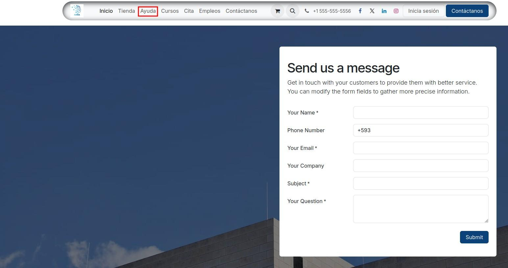
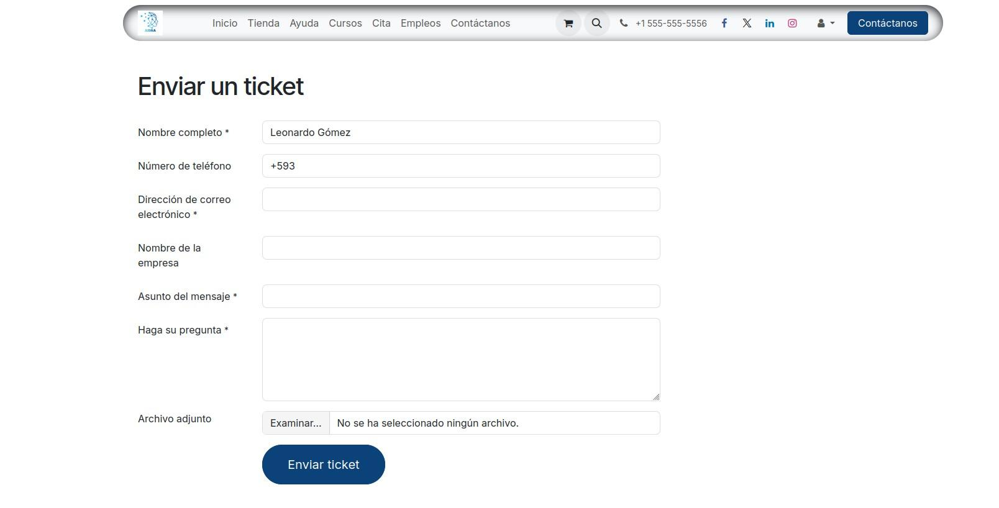
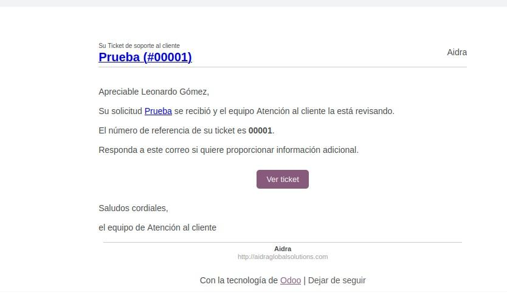

.. _manual_tickets_soporte:

==================================================
MANUAL DE USUARIO: CREACIÓN DE TICKETS DE SOPORTE
==================================================

:Sistema: Portal de Ayuda — Aidra
:Sitio web: https://aidra.odoo.com/

.. contents:: Contenido
   :local:
   :depth: 2

1. Introducción
===============

Este manual describe, paso a paso, cómo crear un ticket de soporte a través del
portal de Ayuda de Aidra. Un ticket es una solicitud formal de atención que le
permite reportar novedades, inconvenientes o consultas, y hacer seguimiento a su
resolución por parte del equipo de Atención al Cliente.

Al finalizar el registro, usted recibirá un correo electrónico de confirmación
con el número de referencia de su ticket, con el cual podrá dar seguimiento a su
solicitud.

2. Requisitos previos
=====================

* **Conexión a internet** y un navegador web actualizado (Chrome, Edge, Firefox,
  etc.).
* **Una cuenta de correo electrónico activa**, ya que allí recibirá las
  notificaciones del proceso.
* **Información del inconveniente:** descripción clara y, de ser posible,
  capturas de pantalla o archivos de respaldo.

3. Paso 1 — Ingresar a la sección Ayuda
=======================================

Ingrese al sitio web de Aidra (https://aidra.odoo.com/) y, en el menú superior,
seleccione la opción **Ayuda**.

   Figura 1. Ubicación de la sección Ayuda en el menú principal.

4. Paso 2 — Completar el formulario del ticket
==============================================

Dentro de la sección Ayuda encontrará el formulario **Enviar un ticket**.
Complete cada campo con la información solicitada. Los campos marcados con
asterisco (\*) son obligatorios.

   Figura 2. Formulario para el envío de tickets.

A continuación se detalla la información que debe registrar en cada campo:

.. list-table::
   :header-rows: 1
   :widths: 35 65

   * - Campo
     - Descripción
   * - Nombre completo \*
     - Nombre y apellido de la persona que solicita el soporte.
   * - Número de teléfono
     - Número de móvil de contacto (incluya el código de país, p. ej. +593).
   * - Dirección de correo electrónico \*
     - Correo al que llegarán todas las notificaciones sobre el avance del
       ticket.
   * - Nombre de la empresa
     - Empresa u organización a la que pertenece el solicitante.
   * - Asunto del mensaje \*
     - Título breve que resuma el motivo del ticket.
   * - Haga su pregunta \*
     - Descripción detallada de la novedad o inconveniente presentado.
   * - Archivo adjunto
     - Archivo opcional (captura de pantalla, documento, etc.) que ayude a
       detallar el inconveniente.

.. tip::

   Mientras más clara y completa sea la descripción del inconveniente
   (incluyendo capturas de pantalla en el campo Archivo adjunto), más rápido
   podrá el equipo de soporte atender su solicitud.

Una vez completados los datos, haga clic en el botón **Enviar ticket**.

5. Paso 3 — Confirmación de la creación del ticket
==================================================

Al enviar el formulario, Odoo generará automáticamente su ticket y usted
recibirá un correo electrónico de confirmación como el siguiente:

   Figura 3. Correo de confirmación con el número de referencia del ticket.

Este correo contiene la siguiente información importante:

* **Número de referencia:** identificador único de su ticket (por ejemplo,
  00001). Consérvelo para futuras consultas.
* **Botón "Ver ticket":** le permite acceder en línea al detalle y estado de su
  solicitud.
* **Respuesta al correo:** si desea proporcionar información adicional, basta
  con responder directamente a este correo; su mensaje quedará registrado en el
  ticket.

6. Seguimiento de su ticket
===========================

El equipo de Atención al Cliente revisará su solicitud y le mantendrá informado
a través del correo electrónico registrado. Cualquier actualización, respuesta o
solución será notificada por ese medio.

Si necesita agregar información después de haber enviado el ticket, no cree uno
nuevo: responda al correo de confirmación indicando el número de referencia, y
la información se añadirá automáticamente a su caso.

----

*Gracias por utilizar nuestro portal de soporte. Estamos comprometidos con
brindarle una atención oportuna y de calidad.*
